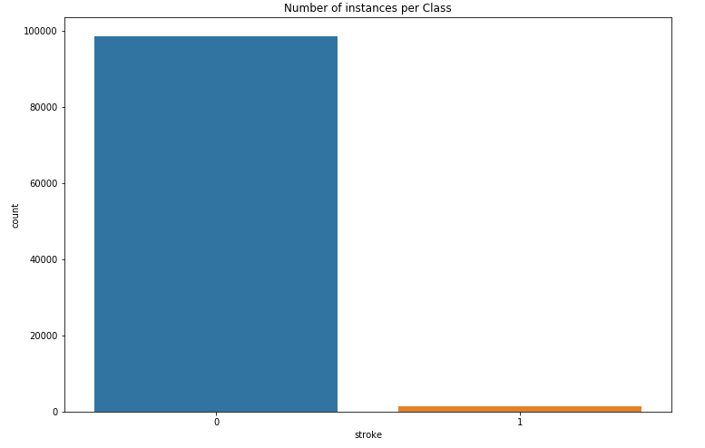
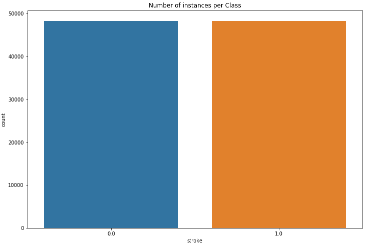

## Storke Prediction 

The objective is to predict brain stroke from patient's records such as age, bmi score, heart problem, hypertension and smoking practice. The dataset includes 100k patient records. Among the records, 1.5% of them are related to stroke patients and the remaining 98.5% of them are related to non-stroke patients. Therefore, the data is extremely imbalanced.

• Dataproc and Google Cloud Platform is used to set up spark clusters. 
• PySpark and MLlib is used to develop the model. 
• Different data imputation techniques are applied to process the missing data. 
• Edited Nearest Neighbours under-sampling technique is used on the majority class (non-stroke patient) and SMOTE over sampling technique is used on the minority class (stroke-patient). 
• Bagging (i.e., Random Forest) and Boosting approach (i.e., Gradient Boosting Tree) are applied on the processed data.  
• Without sampling AUC=0.5. After applying sampling techniques, the best performance is achieved using the bagging approach with AUC = 0.8. 

## Data
The dataset is collected from the following link: 
https://bigml.com/dashboard/dataset/5e92c6d14f6bfd2dd00044a9

## Before Sampling 

## After Sampling 

## How to run:
Please check the Stroke Prediction.ipynb for details.

